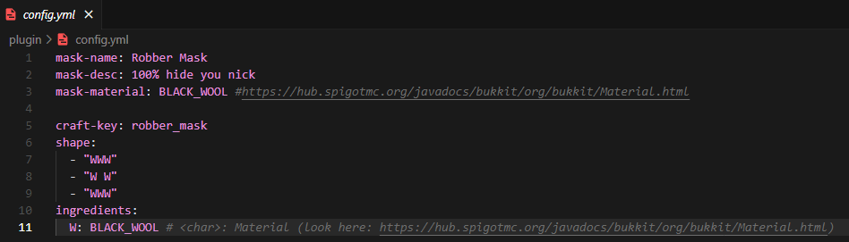
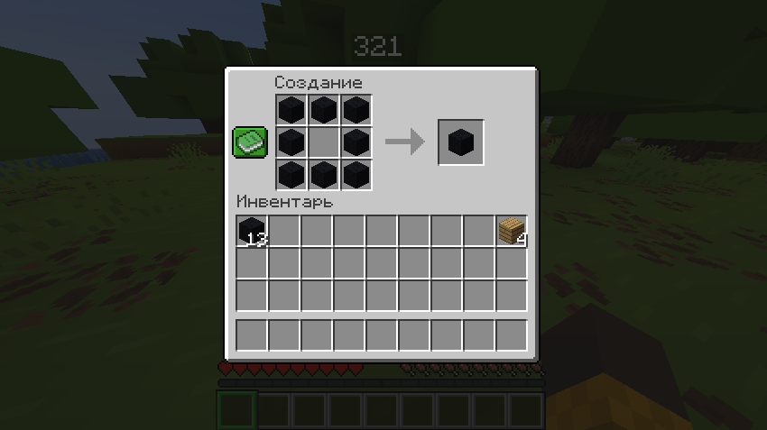
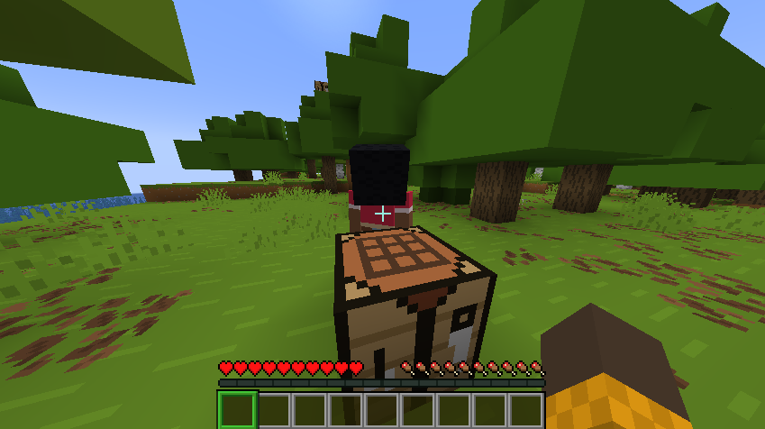

# 🗿 Robber Mask
`minecraft plugin`
 

## Features:
- 🤐 Hide your face
- 🎃 Hide your nickname
- ✨ Custom craft
- 💎 Simple to use

## Usage:
`Add the .jar file to the server's plugins folder, then start or restart your server.`

## Dependencies:
- ☕ `Java 17+`
- 🧩 `Paper 1.19.4+`

## Config:

## Screenshots:

